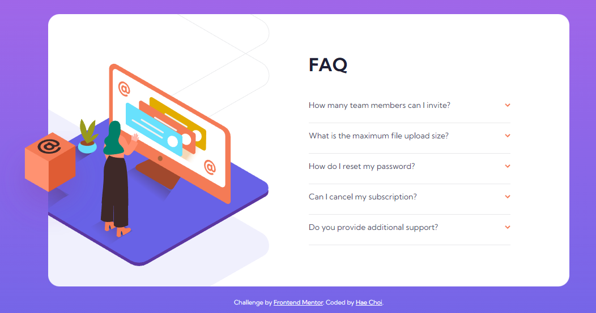
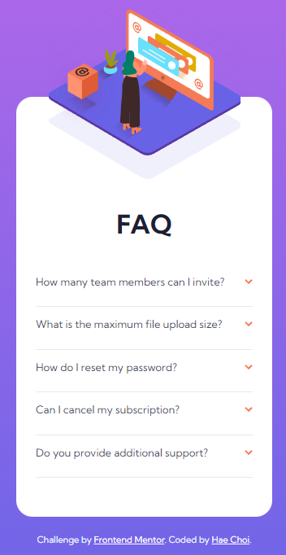

# Frontend Mentor - FAQ accordion card solution

This is a solution to the [FAQ accordion card challenge on Frontend Mentor](https://www.frontendmentor.io/challenges/faq-accordion-card-XlyjD0Oam). Frontend Mentor challenges help you improve your coding skills by building realistic projects.

## Overview

### The challenge

Users should be able to:

- View the optimal layout for the component depending on their device's screen size
- See hover states for all interactive elements on the page
- Hide/Show the answer to a question when the question is clicked

### Screenshot




## My process

### Built with

- Semantic HTML5 markup
- CSS custom properties
- Flexbox
- CSS Grid
- Vanilla JS

### What I learned

- Using transform translate is very useful for securing desired exact position.
- Use height and overflow hidden for collapsable panels. Display none will affect max-width of container.
- Some property values, like auto, will not work as transitions. Because of this I decided to hardcode the height in px, which isn't ideal.

- I learned about the forEach method which seems like a more streamlined for loop approach to iterate through the elements of the node. I used this method to apply a click event to every element of the DOM.

```js
titles.forEach((title) => {
  title.addEventListener("click", () => {
    // IF PANEL IS ALREADY OPEN WHEN CLICKED, CLOSE SAID PANEL
    if (title.classList.contains("is-open")) {
      title.classList.remove("is-open");
    } else {
      // IF PANEL IS NOT OPEN WHEN CLICKED, OPEN IT AND CLOSE ANY OTHER OPEN PANELS
      const titlesWithIsOpen = document.querySelectorAll(".is-open");
      titlesWithIsOpen.forEach((titleWithIsOpen) => {
        titleWithIsOpen.classList.remove("is-open");
      });
      title.classList.add("is-open");
    }
  });
});
```

### Continued development

- How to create flexible/responsive height when a panel is opened? Currently it is hardcoded.

### Useful resources

- [Example resource 1](https://www.itzami.com/blog/how-to-build-an-accordion-with-javascript) - A straightforward guide to creating a basic accordion that opens just one panel per click.
- [Example resource 2](https://www.freecodecamp.org/news/build-an-accordion-menu-using-html-css-and-javascript/) - This article taught me to set the open/close panel with a height of 0 add overflow of hidden to collapse the content, instead of using display none to preserve the main max-width.

## Author

- Frontend Mentor - [@dagimchi](https://www.frontendmentor.io/profile/dagimchi)
- Twitter - [@dagimchi](https://www.twitter.com/dagimchi)

## Acknowledgments

Hats off to Rui Sousa @HeyItzaMi for the accordion how-to~
